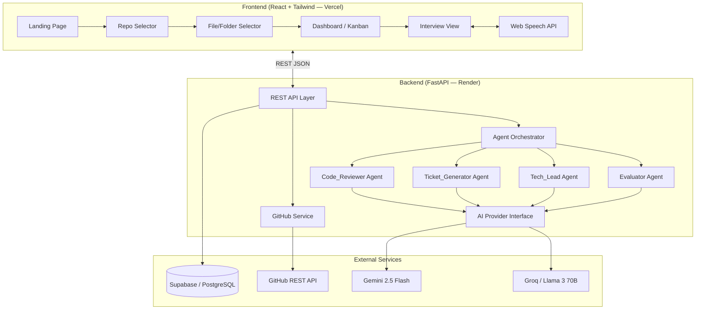
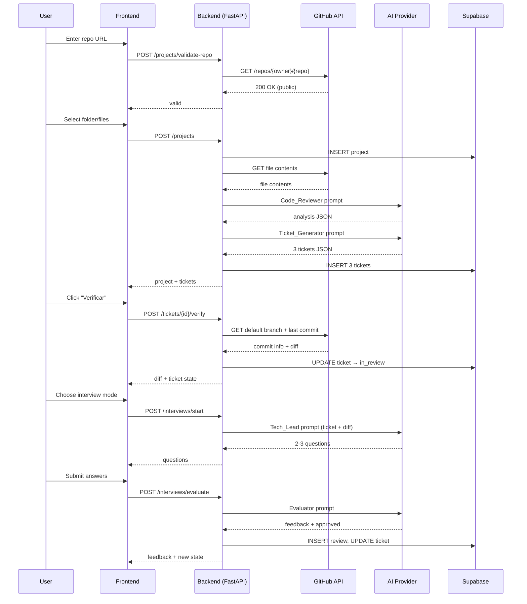
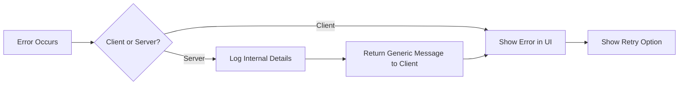

# Design Document — DevCoach AI

## Overview

DevCoach AI is a single-page application that converts a folder from a user's public GitHub repository into a 3-ticket improvement plan. The system orchestrates 4 AI agents (specialized prompts behind a common provider interface) through a linear workflow: repository connection → code analysis → ticket generation → commit verification → simulated interview → evaluation.

The architecture follows a clean client-server split: a React + Tailwind CSS frontend communicates via REST with a single FastAPI backend, which persists state in Supabase (PostgreSQL) and delegates AI inference to either Gemini 2.5 Flash or Groq (Llama 3 70B) through an interchangeable provider abstraction. Voice mode uses the browser's native Web Speech API — no audio ever leaves the client.

### Key Design Decisions

| Decision | Rationale |
|----------|-----------|
| Single FastAPI service | Hackathon scope; eliminates inter-service contracts and reduces deployment surface |
| Provider abstraction for AI | Allows latency-based provider switching without touching agent logic |
| Web Speech API for voice | Zero server cost, no audio pipelines, graceful degradation to text |
| GitHub PAT via env variable | Higher rate limit (5000 req/h) without user OAuth complexity |
| Supabase as sole DB | Managed PostgreSQL with built-in REST API; reduces ops burden |
| No user authentication | MVP operates with a single demo session per instance |

## Architecture



### Request Flow (Happy Path)



## Components and Interfaces

### Frontend Components

| Component | Responsibility |
|-----------|---------------|
| `RepoInput` | URL input with validation feedback, format check before submit |
| `FileSelector` | Tree view (3 levels deep), checkbox selection, file counter |
| `Dashboard` | Kanban board with 3 columns, ticket cards, state refresh |
| `TicketCard` | Displays title, description (truncated), priority, difficulty, time |
| `InterviewModeSelector` | Radio/button choice between Chat and Llamada |
| `ChatInterface` | Bubble-style messages, avatar, text input (max 2000 chars) |
| `VoiceInterface` | SpeechRecognition capture, SpeechSynthesis playback, subtitle overlay |
| `FeedbackDisplay` | Visual differentiation for approval/rejection |

### Backend API Endpoints

| Method | Path | Description |
|--------|------|-------------|
| POST | `/api/projects/validate-repo` | Validates GitHub URL format and repo accessibility |
| POST | `/api/projects` | Creates project, triggers analysis pipeline |
| GET | `/api/projects/{id}/tickets` | Returns tickets for a project |
| POST | `/api/tickets/{id}/verify` | Verifies last commit, returns diff |
| POST | `/api/interviews/start` | Generates Tech_Lead questions |
| POST | `/api/interviews/evaluate` | Evaluates user answers, returns feedback |

### Backend Internal Modules

```
backend/
├── app/
│   ├── main.py                    # FastAPI app, startup checks
│   ├── config.py                  # Env var loading, validation
│   ├── api/
│   │   ├── projects.py            # Project endpoints
│   │   ├── tickets.py             # Ticket endpoints
│   │   └── interviews.py          # Interview endpoints
│   ├── ai/
│   │   ├── provider.py            # AIProvider interface + factory
│   │   ├── gemini_provider.py     # Gemini implementation
│   │   ├── groq_provider.py       # Groq implementation
│   │   ├── code_reviewer.py       # Code_Reviewer agent function
│   │   ├── ticket_generator.py    # Ticket_Generator agent function
│   │   ├── tech_lead.py           # Tech_Lead agent function
│   │   └── evaluator.py           # Evaluator agent function
│   ├── services/
│   │   ├── github_service.py      # GitHub API interactions
│   │   └── db_service.py          # Supabase CRUD operations
│   └── models/
│       ├── project.py             # Project Pydantic models
│       ├── ticket.py              # Ticket Pydantic models
│       └── review.py              # Review Pydantic models
```

### AI Provider Interface

```python
from abc import ABC, abstractmethod

class AIProvider(ABC):
    """Common interface for AI providers. Agents call only this."""

    @abstractmethod
    async def generate(self, prompt: str, *, timeout: float = 30.0) -> str:
        """Send a text prompt, receive a text response."""
        ...

class GeminiProvider(AIProvider):
    async def generate(self, prompt: str, *, timeout: float = 30.0) -> str:
        # Uses google-generativeai SDK internally
        ...

class GroqProvider(AIProvider):
    async def generate(self, prompt: str, *, timeout: float = 30.0) -> str:
        # Uses groq SDK internally
        ...

def get_provider() -> AIProvider:
    """Factory: reads AI_PROVIDER env var, returns singleton."""
    provider = os.environ["AI_PROVIDER"]  # "gemini" or "groq"
    if provider == "gemini":
        return GeminiProvider()
    elif provider == "groq":
        return GroqProvider()
    raise ValueError(f"Invalid AI_PROVIDER: {provider}")
```

### Agent Function Signatures

Each agent is a standalone async function that depends only on `AIProvider.generate()`:

```python
# code_reviewer.py
async def analyze_code(provider: AIProvider, files: dict[str, str]) -> CodeReviewResult:
    """Analyzes code files. Returns strengths + weaknesses JSON."""
    ...

# ticket_generator.py
async def generate_tickets(provider: AIProvider, review: CodeReviewResult) -> list[TicketData]:
    """Generates exactly 3 improvement tickets from a code review."""
    ...

# tech_lead.py
async def generate_questions(provider: AIProvider, ticket: TicketData, diff: str) -> list[str]:
    """Generates 2-3 interview questions based on ticket + diff."""
    ...

# evaluator.py
async def evaluate_answers(
    provider: AIProvider, 
    ticket: TicketData, 
    diff: str, 
    questions: list[str], 
    answers: list[str]
) -> EvaluationResult:
    """Evaluates user answers. Returns feedback + approved boolean."""
    ...
```

### GitHub Service Interface

```python
class GitHubService:
    def __init__(self, token: str):
        self.token = token
        self.base_url = "https://api.github.com"
        self.timeout = 10.0  # seconds

    async def validate_repo(self, owner: str, repo: str) -> bool:
        """Check if repo exists and is public."""
        ...

    async def get_tree(self, owner: str, repo: str, path: str = "", depth: int = 3) -> list[TreeEntry]:
        """Get directory structure up to N levels deep."""
        ...

    async def get_file_content(self, owner: str, repo: str, path: str) -> str:
        """Get decoded file content (max 1MB)."""
        ...

    async def get_last_commit(self, owner: str, repo: str) -> CommitInfo:
        """Get last commit on default branch with diff."""
        ...

    async def get_default_branch(self, owner: str, repo: str) -> str:
        """Get the repository's default branch name."""
        ...
```

## Data Models

### Database Schema (Supabase / PostgreSQL)

```sql
-- Projects table
CREATE TABLE projects (
    id UUID PRIMARY KEY DEFAULT gen_random_uuid(),
    repo_url TEXT NOT NULL CHECK (char_length(repo_url) <= 2048),
    archivos_seleccionados TEXT[] NOT NULL,
    fecha_analisis TIMESTAMPTZ NOT NULL DEFAULT NOW()
);

-- Tickets table
CREATE TABLE tickets (
    id UUID PRIMARY KEY DEFAULT gen_random_uuid(),
    project_id UUID NOT NULL REFERENCES projects(id) ON DELETE CASCADE,
    titulo TEXT NOT NULL CHECK (char_length(titulo) <= 200),
    descripcion TEXT NOT NULL CHECK (char_length(descripcion) <= 2000),
    prioridad TEXT NOT NULL CHECK (prioridad IN ('alta', 'media', 'baja')),
    dificultad TEXT NOT NULL CHECK (dificultad IN ('fácil', 'media', 'difícil')),
    tiempo_estimado TEXT NOT NULL CHECK (char_length(tiempo_estimado) <= 50),
    estado TEXT NOT NULL DEFAULT 'to_do' CHECK (estado IN ('to_do', 'in_review', 'done'))
);

-- Reviews table
CREATE TABLE reviews (
    id UUID PRIMARY KEY DEFAULT gen_random_uuid(),
    ticket_id UUID NOT NULL REFERENCES tickets(id) ON DELETE CASCADE,
    preguntas_generadas TEXT[] NOT NULL CHECK (
        array_length(preguntas_generadas, 1) BETWEEN 2 AND 3
    ),
    respuesta_usuario TEXT NOT NULL CHECK (char_length(respuesta_usuario) <= 5000),
    feedback_evaluator TEXT NOT NULL CHECK (char_length(feedback_evaluator) <= 3000),
    aprobado BOOLEAN NOT NULL
);
```

### Pydantic Models (Backend)

```python
from pydantic import BaseModel, Field
from uuid import UUID
from datetime import datetime
from enum import Enum

class Prioridad(str, Enum):
    ALTA = "alta"
    MEDIA = "media"
    BAJA = "baja"

class Dificultad(str, Enum):
    FACIL = "fácil"
    MEDIA = "media"
    DIFICIL = "difícil"

class EstadoTicket(str, Enum):
    TO_DO = "to_do"
    IN_REVIEW = "in_review"
    DONE = "done"

class ProjectCreate(BaseModel):
    repo_url: str = Field(max_length=2048)
    archivos_seleccionados: list[str] = Field(min_length=1, max_length=50)

class ProjectResponse(BaseModel):
    id: UUID
    repo_url: str
    archivos_seleccionados: list[str]
    fecha_analisis: datetime

class TicketResponse(BaseModel):
    id: UUID
    project_id: UUID
    titulo: str = Field(max_length=200)
    descripcion: str = Field(max_length=2000)
    prioridad: Prioridad
    dificultad: Dificultad
    tiempo_estimado: str = Field(max_length=50)
    estado: EstadoTicket

class InterviewStartRequest(BaseModel):
    ticket_id: UUID
    mode: str = Field(pattern="^(chat|llamada)$")

class InterviewAnswersRequest(BaseModel):
    ticket_id: UUID
    questions: list[str] = Field(min_length=2, max_length=3)
    answers: list[str] = Field(min_length=2, max_length=3)

class EvaluationResponse(BaseModel):
    feedback: str = Field(max_length=3000)
    aprobado: bool

class ReviewResponse(BaseModel):
    id: UUID
    ticket_id: UUID
    preguntas_generadas: list[str]
    respuesta_usuario: str
    feedback_evaluator: str
    aprobado: bool

class CodeReviewResult(BaseModel):
    fortalezas: list[str]
    debilidades: list[str]

class TicketData(BaseModel):
    titulo: str = Field(max_length=120)
    descripcion: str
    prioridad: Prioridad
    dificultad: Dificultad
    tiempo_estimado_minutos: int = Field(ge=15, le=480)
```

### AI Agent Input/Output Contracts

| Agent | Input | Output |
|-------|-------|--------|
| Code_Reviewer | `{files: {path: content}}` | `{fortalezas: [str], debilidades: [str]}` |
| Ticket_Generator | `CodeReviewResult` JSON | `[{titulo, descripcion, prioridad, dificultad, tiempo_estimado_minutos}] (len=3)` |
| Tech_Lead | `{ticket: TicketData, diff: str}` | `[str] (len 2-3)` — list of questions |
| Evaluator | `{ticket, diff, questions, answers}` | `{feedback: str, aprobado: bool}` |


## Correctness Properties

*A property is a characteristic or behavior that should hold true across all valid executions of a system — essentially, a formal statement about what the system should do. Properties serve as the bridge between human-readable specifications and machine-verifiable correctness guarantees.*

### Property 1: GitHub URL Validation Correctness

*For any* input string, the URL validation function SHALL accept it if and only if it matches the pattern `https://github.com/{owner}/{repo}` where owner and repo are non-empty strings containing valid GitHub characters. All whitespace-only strings, empty strings, and non-matching formats SHALL be rejected.

**Validates: Requirements 1.2, 1.3, 1.4**

### Property 2: File Selection Count Constraint

*For any* set of files selected by the user, the system SHALL accept the selection if and only if the count is between 1 and 50 inclusive. Selections with 0 files or more than 50 files SHALL be rejected with the confirmation action disabled.

**Validates: Requirements 2.2, 2.4, 2.5**

### Property 3: Code Review Response Parsing

*For any* valid JSON object containing `fortalezas` (array of strings) and `debilidades` (array of strings), the Code_Reviewer response parser SHALL produce a correct `CodeReviewResult` instance. For any JSON not matching this schema, the parser SHALL raise a validation error.

**Validates: Requirements 3.3, 3.8**

### Property 4: Ticket Generator Output Validation

*For any* AI-generated JSON response, the ticket parser SHALL accept it if and only if it contains exactly 3 objects, each with: `titulo` (≤120 chars), `descripcion` (string), `prioridad` ∈ {alta, media, baja}, `dificultad` ∈ {fácil, media, difícil}, and `tiempo_estimado_minutos` ∈ [15, 480]. Any deviation SHALL be rejected.

**Validates: Requirements 3.4, 3.5**

### Property 5: Ticket Display Truncation

*For any* ticket with a title of length N, the displayed title SHALL equal the original if N ≤ 80, or the first 80 characters plus a truncation indicator if N > 80. Similarly, for description of length M, the display SHALL be the original if M ≤ 200, or first 200 characters plus indicator if M > 200.

**Validates: Requirements 4.2**

### Property 6: Ticket-to-Column Mapping

*For any* ticket with state S ∈ {to_do, in_review, done}, the ticket SHALL be placed in the column whose identifier equals S. No ticket SHALL appear in more than one column.

**Validates: Requirements 4.3**

### Property 7: Commit Relevance Detection

*For any* set of project files P and set of commit-changed files C, the system SHALL proceed to interview if and only if the intersection P ∩ C is non-empty. When the intersection is empty, the ticket state SHALL revert to "to_do".

**Validates: Requirements 5.5, 5.6**

### Property 8: Ticket State Transitions After Evaluation

*For any* ticket in state "in_review" receiving an evaluation result, the state SHALL transition to "done" if aprobado is true, and SHALL remain "in_review" if aprobado is false. No other state transitions SHALL occur from evaluation.

**Validates: Requirements 7.3, 7.4**

### Property 9: Interview Answer Validation

*For any* set of answers submitted for an interview with N questions (2 ≤ N ≤ 3), submission SHALL be accepted if and only if exactly N non-empty answers are provided and each answer has at most 2000 characters.

**Validates: Requirements 6.10, 6.11**

### Property 10: Interview Mode Switch Preserves State

*For any* interview conversation state (questions generated, answers already entered), switching from "Llamada" to "Chat" mode SHALL preserve all existing questions and previously entered answers without data loss.

**Validates: Requirements 6.7**

### Property 11: Backend Receives Only Text

*For any* interview request sent to the backend (regardless of whether the client uses Chat or Llamada mode), the request payload SHALL contain exclusively text fields. No binary audio data SHALL be present in the request.

**Validates: Requirements 6.4**

### Property 12: AI Provider Factory Validation

*For any* string value of the AI_PROVIDER environment variable, the provider factory SHALL return a valid provider instance if and only if the value is "gemini" or "groq". For any other value or undefined variable, the factory SHALL raise a startup error.

**Validates: Requirements 8.4, 8.5**

### Property 13: Data Model Serialization Round Trip

*For any* valid Project, Ticket, or Review instance, serializing to a dictionary and deserializing back SHALL produce an object equal to the original. Field constraints (max lengths, enumerations, ranges) SHALL be enforced during deserialization.

**Validates: Requirements 9.1, 9.2, 9.3**

### Property 14: Database Error Message Sanitization

*For any* database error that occurs during read/write operations, the client-facing error response SHALL NOT contain internal database details (table names, column names, SQL statements, connection strings). Only a generic error message SHALL be returned.

**Validates: Requirements 9.6**

### Property 15: Rate Limit Header Parsing

*For any* GitHub API response with HTTP 429 or HTTP 403 status containing `X-RateLimit-Remaining: 0` and a valid `X-RateLimit-Reset` timestamp, the system SHALL correctly calculate and display the remaining wait time in a human-readable format.

**Validates: Requirements 10.7**

### Property 16: File Size Limit Enforcement

*For any* file size value returned by the GitHub API, the system SHALL allow content retrieval if and only if the file size is ≤ 1 MB (1,048,576 bytes). Files exceeding this limit SHALL be rejected with an appropriate message.

**Validates: Requirements 10.9**

### Property 17: Tech Lead Question Count Validation

*For any* response from the Tech_Lead agent, the parser SHALL accept it if and only if it contains between 2 and 3 questions (inclusive). Responses with fewer than 2 or more than 3 questions SHALL be rejected.

**Validates: Requirements 6.8**

### Property 18: Evaluator Response Validation

*For any* response from the Evaluator agent, the parser SHALL accept it if and only if it contains a `feedback` field (≤ 3000 characters) and an `aprobado` field (boolean). Responses missing fields or exceeding the character limit SHALL be rejected.

**Validates: Requirements 7.1**

## Error Handling

### Error Categories and Strategies

| Category | Source | Strategy | User-Facing Message |
|----------|--------|----------|-------------------|
| Network Timeout | GitHub API (10s), AI Provider (30s/60s) | Abort request, surface error | "No se pudo conectar con [servicio]. Intenta nuevamente." |
| Rate Limiting | GitHub API (429/403) | Parse X-RateLimit-Reset header | "Se alcanzó el límite de peticiones. Espera [N] minutos." |
| Invalid AI Response | Code_Reviewer, Ticket_Generator, Tech_Lead, Evaluator | Validate JSON schema, reject if invalid | "El análisis no pudo completarse. Intenta nuevamente." |
| Repository Not Found | GitHub API (404/403) | Map to generic message | "El repositorio no fue encontrado o no es público." |
| File Too Large | GitHub API (>1MB) | Check size before fetch | "El archivo excede el límite de 1 MB soportado." |
| Database Error | Supabase | Catch exception, log details, return generic error | "No se pudo completar la operación. Intenta nuevamente." |
| Missing Config | Env vars at startup | Fail-fast with explicit error in logs | Backend does not start; logs identify missing variable |
| Invalid Provider | AI_PROVIDER env var | Fail-fast at startup | Backend does not start; logs identify invalid value |

### Error Propagation Flow



### Retry Policy

- **No automatic retries** for any operation. All retries are user-initiated.
- Rationale: In a hackathon MVP, automatic retries add complexity and can mask issues. User-initiated retries provide predictable behavior.
- Each error message that permits retry SHALL include a visible retry button/action.

### Startup Validation

The backend SHALL validate at startup (fail-fast):
1. `AI_PROVIDER` env var is "gemini" or "groq"
2. `GITHUB_TOKEN` env var is defined (non-empty)
3. `SUPABASE_URL` and `SUPABASE_KEY` env vars are defined

If any validation fails, the process exits with code 1 and an explicit log message naming the missing/invalid variable.

## Testing Strategy

### Enfoque Pragmático para Hackathon

Este proyecto es un MVP de hackathon (1 semana, 4 personas — dos sin experiencia significativa en desarrollo). La estrategia de testing prioriza confianza en el flujo de demo sobre cobertura exhaustiva. No se implementa property-based testing automatizado (Hypothesis, fast-check) ni suites e2e con Playwright. Esas herramientas son candidatas para una fase posterior al Demo Day.

Las 18 Correctness Properties definidas en la sección anterior se mantienen como **checklist de validación manual/QA**: guían qué casos borde y condiciones de contorno verificar manualmente durante el Día 6 (QA pre-demo), no como especificación de tests automatizados.

### Nivel 1: Tests Unitarios Puntuales (pytest, backend)

Tests automatizados mínimos que cubren la lógica con mayor riesgo de romperse silenciosamente entre integraciones. Se ejecutan con `pytest` y no requieren conexión a servicios externos (mocks donde sea necesario).

**Alcance:**

| Módulo | Qué se testea | Casos ejemplo |
|--------|---------------|---------------|
| Parseo de respuestas AI | Validar que el JSON de cada agente se parsea correctamente o lanza error claro | JSON válido de Code_Reviewer, JSON con campo faltante, JSON con tipos incorrectos, respuesta vacía |
| Validación de URL GitHub | Verificar aceptación/rechazo de formatos de URL | URL válida, URL sin owner, URL con path extra, string vacío, URL de otro dominio |
| Transiciones de estado de ticket | Confirmar que las transiciones permitidas ocurren y las inválidas se rechazan | to_do → in_review (OK), in_review → done (OK), done → to_do (rechazado), to_do → done (rechazado) |
| Provider factory | Verificar que "gemini" y "groq" instancian correctamente y valores inválidos lanzan error | "gemini" (OK), "groq" (OK), "openai" (error), "" (error), None (error) |

**Estructura de archivos:**

```
backend/
├── tests/
│   ├── test_ai_parsers.py          # Parseo JSON de los 4 agentes
│   ├── test_url_validation.py      # Formato de URL de GitHub
│   ├── test_ticket_states.py       # Transiciones de estado
│   ├── test_provider_factory.py    # Factory de AI provider
│   └── conftest.py                 # Fixtures comunes (mocks de provider, datos de ejemplo)
```

**Criterio de suficiencia:** 3-5 casos concretos por función (happy path + 2-3 casos de error representativos). No generación exhaustiva de inputs.

### Nivel 2: QA Manual Guiado por Checklist (Día 6)

Una sesión de QA manual ejecutada sobre el flujo completo desplegado, usando el repo de demo controlado. La checklist se deriva de las 18 Correctness Properties y de la tabla de Error Handling.

**Checklist de Correctness Properties:**

| # | Property | Verificación manual |
|---|----------|-------------------|
| 1 | URL Validation | Probar URL válida, URL de repo privado, URL malformada, campo vacío |
| 2 | File Selection Count | Seleccionar 0, 1, 50, y 51 archivos — confirmar habilitación/deshabilitación del botón |
| 3 | Code Review Parsing | Confirmar que el análisis completa y muestra fortalezas/debilidades |
| 4 | Ticket Generator Output | Verificar que se generan exactamente 3 tickets con todos los campos visibles |
| 5 | Ticket Display Truncation | Crear ticket con título >80 chars y descripción >200 chars, verificar truncamiento |
| 6 | Ticket-to-Column Mapping | Confirmar que cada ticket aparece en la columna correcta según su estado |
| 7 | Commit Relevance | Hacer commit sin cambios en archivos del proyecto, verificar que no avanza |
| 8 | State Transitions | Aprobar ticket → confirmar que pasa a "done"; rechazar → confirmar que queda en "in_review" |
| 9 | Interview Answers | Intentar enviar sin responder todas las preguntas, confirmar bloqueo |
| 10 | Mode Switch | Cambiar de Llamada a Chat durante entrevista, verificar que preguntas y respuestas se preservan |
| 11 | Backend Text-Only | Inspeccionar request en DevTools: confirmar que no hay payload binario |
| 12 | Provider Factory | Arrancar backend con AI_PROVIDER inválido, confirmar que no arranca |
| 13 | Data Roundtrip | Crear proyecto, verificar que los datos persisten y se recuperan correctamente |
| 14 | Error Sanitization | Provocar error de DB (ej. constraint violation), confirmar que el cliente no ve detalles internos |
| 15 | Rate Limit | Simular respuesta 429 (si es posible), verificar mensaje con tiempo de espera |
| 16 | File Size Limit | Intentar seleccionar archivo >1MB, confirmar mensaje de error |
| 17 | Tech Lead Questions | Confirmar que la entrevista genera entre 2 y 3 preguntas |
| 18 | Evaluator Response | Confirmar que el feedback se muestra y el estado del ticket se actualiza |

**Checklist de Error Handling:**

| Escenario | Acción de verificación |
|-----------|----------------------|
| GitHub API timeout | Desconectar red o usar repo inexistente, verificar mensaje de error y opción de reintento |
| AI Provider timeout | Simular latencia alta, verificar mensaje de timeout |
| Respuesta AI inválida | (Verificar en logs si ocurre naturalmente durante QA) |
| Repo no encontrado | Ingresar URL de repo que no existe |
| Error de DB | Verificar que errores no exponen SQL ni nombres de tabla |
| Variables de entorno faltantes | Arrancar backend sin GITHUB_TOKEN, sin SUPABASE_URL — confirmar fail-fast |

### Fuera de Alcance (Post-Hackathon)

Los siguientes elementos de testing quedan explícitamente fuera del MVP y son candidatos para implementarse después del Demo Day:

- **Property-based testing automatizado** (Hypothesis, fast-check) para verificación exhaustiva de las 18 properties
- **Tests e2e automatizados** (Playwright, Cypress) para regresión del flujo completo
- **Tests de componentes frontend** (React Testing Library) más allá de verificación manual
- **Tests de integración con Supabase** contra base de datos de test
- **Tests de carga/performance** para validar tiempos de respuesta bajo concurrencia
