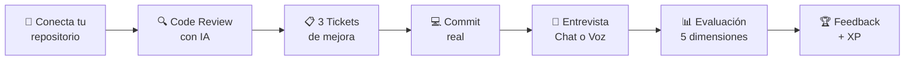
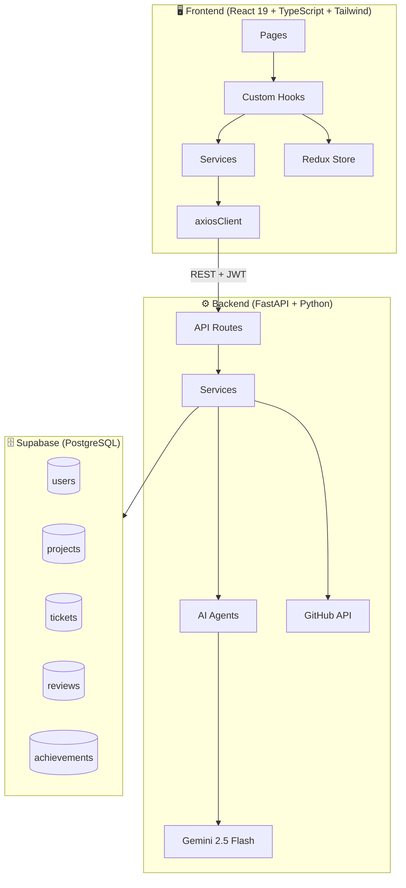
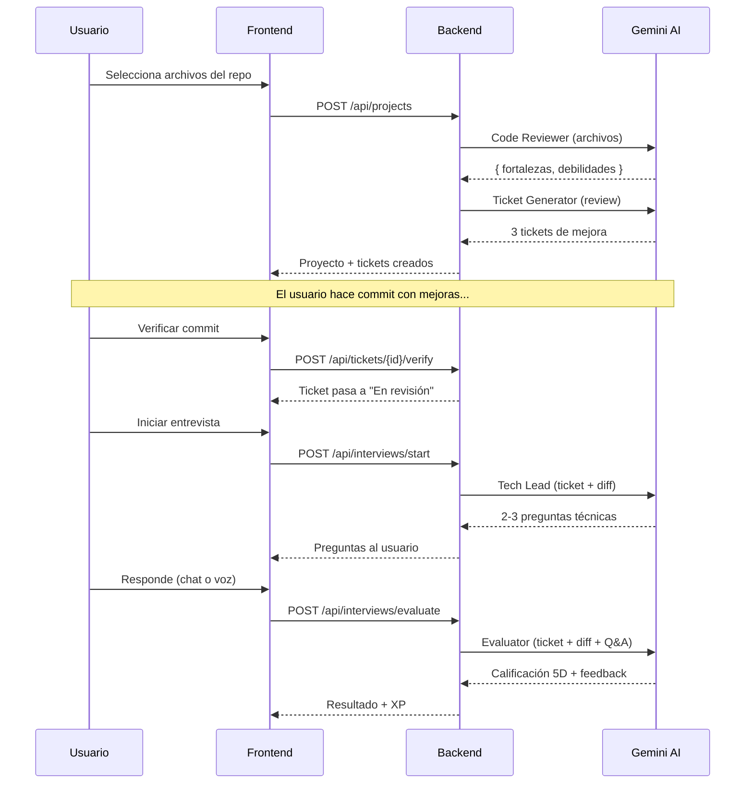
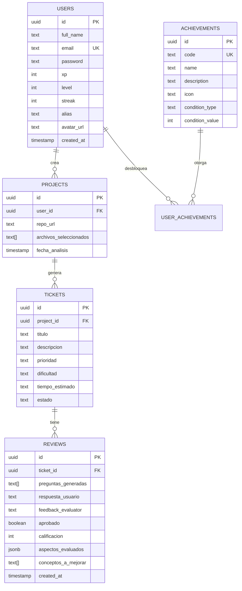
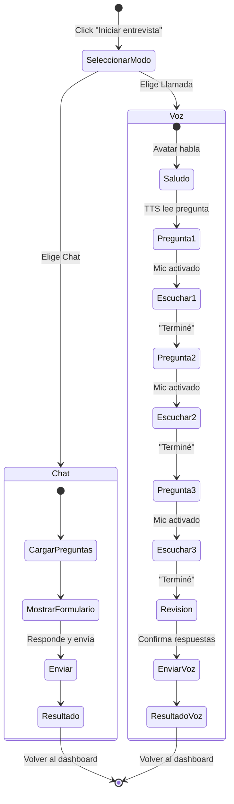
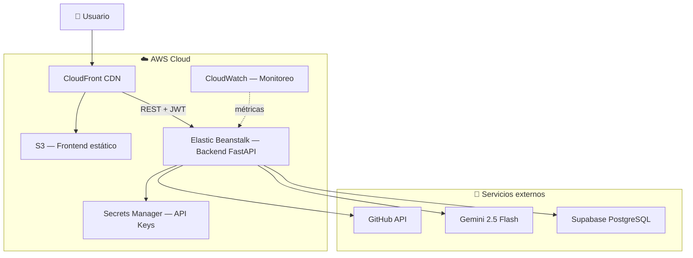

<div align="center">

# 🧠 DevCoach AI

**Tu coach técnico con IA que trabaja con tu código real**

[](https://react.dev)
[](https://fastapi.tiangolo.com)
[](https://typescriptlang.org)
[](https://ai.google.dev)
[](https://supabase.com)
[](https://tailwindcss.com)

</div>

---

## 🔗 Demo y Enlaces

| | Enlace |
|--|--------|
| 🎬 **Video Demo** | [Video demo](https://drive.google.com/file/d/1QwcC1rgUkxyxGk3NzQoSx1nSbP_9rMhF/view) |
| 🌐 **App en producción (Vercel + Render)** | [Deploy in vercel](https://devcoach-ai-frontend.vercel.app/)_ |
| ☁️ **App en AWS (S3 + Elastic Beanstalk)** | [Deploy in AWS](https://d20a7qc0shf987.cloudfront.net/) |
| 📂 **Repositorio** | [github.com/Lunisa202/DevCoach-AI](https://github.com/Lunisa202/DevCoach-AI) |

---

## ¿Qué es DevCoach AI?

DevCoach AI es una plataforma de coaching técnico impulsada por inteligencia artificial que transforma la forma en que los desarrolladores mejoran sus habilidades. A diferencia de cursos genéricos, DevCoach trabaja directamente con **tu código real** — analiza tu repositorio, genera desafíos personalizados, y te entrevista sobre tus decisiones técnicas.


## 🚀 El Ciclo de Aprendizaje



## ✨ Features Principales

### 🤖 4 Agentes de IA Especializados
| Agente | Rol | Qué hace |
|--------|-----|----------|
| **Code Reviewer** | Analista senior | Detecta fortalezas y debilidades en tu código |
| **Ticket Generator** | Project Manager | Crea 3 tickets de mejora concretos y accionables |
| **Tech Lead** | Entrevistador | Te hace preguntas técnicas sobre tus decisiones |
| **Evaluator** | Evaluador | Califica en 5 dimensiones y decide si apruebas |

### 🎙️ Entrevista por Voz
La primera plataforma que te entrevista **por voz** sobre tu propio código. Speech-to-text en tiempo real, con feedback instantáneo.

### 🎮 Gamificación Completa
- **XP y Niveles** — Curva progresiva de 11 niveles
- **Racha de actividad** — Días consecutivos aprobando entrevistas
- **8 Logros desbloqueables** — Desde "Primera sangre" hasta "Leyenda"
- **Ranking global** — Compite con otros desarrolladores

### 👤 Perfiles Públicos
- Bio, GitHub, LinkedIn
- Stats visibles (proyectos, tickets, promedio)
- Logros desbloqueados
- Accesible desde el ranking

### 📊 Dashboard Inteligente
- Stats en tiempo real (proyectos, tickets, promedio)
- Gráfico de evolución semanal de calificaciones
- XP, nivel y racha visibles
- Progreso por proyecto


## 🏗️ Arquitectura



## 🤖 Pipeline de IA



## 🗄️ Modelo de Datos



## 🎤 Flujo de Entrevista



## 🛠️ Setup Local

### Requisitos
- Python 3.11+
- Node.js 18+
- pnpm
- Cuenta en Supabase (free tier)
- API Key de Gemini (Google AI Studio)

### Backend
```bash
cd backend
python -m venv venv
venv\Scripts\activate          # Windows
# source venv/bin/activate     # Mac/Linux
pip install -r requirements.txt
cp .env.example .env           # Editar con valores reales
uvicorn app.main:app --reload
# → http://localhost:8000/docs
```

### Frontend
```bash
cd frontend
pnpm install --config.minimum-release-age=0
./node_modules/.bin/vite --host
# → http://localhost:5173
```

### Variables de entorno (backend/.env)
```env
AI_PROVIDER=gemini
GEMINI_API_KEY=tu-api-key
GITHUB_TOKEN=tu-github-token
SUPABASE_URL=https://xxx.supabase.co
SUPABASE_KEY=tu-anon-key
JWT_SECRET_KEY=un-secreto-largo
FRONTEND_URL=http://localhost:5173
```


## 📋 Migraciones de Base de Datos

Ejecutar en orden en Supabase → SQL Editor:

| # | Archivo | Qué hace |
|---|---------|----------|
| 001 | `001_initial_schema.sql` | Tablas projects, tickets, reviews |
| 002 | `002_add_users_auth.sql` | Tabla users + FK projects→users |
| 003 | `003_evaluacion_detallada.sql` | Campos de evaluación 5D en reviews |
| 004 | `004_user_api_key.sql` | API key personal del usuario |
| 005 | `005_add_user_alias.sql` | Alias para privacidad en ranking |
| 006 | `006_add_avatar_url.sql` | Avatar URL del usuario |
| 007 | `007_xp_level_streak.sql` | XP, nivel, racha |
| 008 | `008_retroactive_xp.sql` | Script para calcular XP retroactivo |
| 009 | `009_achievements.sql` | Tablas de logros + seed de 8 badges |
| 010 | `010_user_profile_fields.sql` | Bio, LinkedIn, GitHub username |

## 📁 Estructura del Proyecto

```
DevCoach-AI/
├── backend/
│   ├── app/
│   │   ├── ai/              ← 4 agentes de IA + providers
│   │   ├── api/             ← Endpoints REST (auth, projects, interviews, stats, ranking, achievements, profiles)
│   │   ├── models/          ← Modelos Pydantic
│   │   ├── services/        ← GitHub, DB, Auth services
│   │   ├── config.py        ← Variables de entorno
│   │   └── main.py          ← Entry point FastAPI
│   ├── supabase/            ← Migraciones SQL
│   └── requirements.txt
├── frontend/
│   ├── src/
│   │   ├── components/      ← UI reutilizable
│   │   ├── pages/           ← Páginas de la app
│   │   ├── hooks/           ← Custom hooks
│   │   ├── services/        ← API calls (axiosClient)
│   │   ├── store/           ← Redux slices
│   │   └── types/           ← TypeScript interfaces
│   ├── tailwind.config.js
│   └── vite.config.ts
└── docs/                    ← Documentación del proyecto
```

### 📚 Documentación adicional

| Documento | Contenido |
|-----------|-----------|
| [`docs/AWS_ARCHITECTURE.md`](./docs/AWS_ARCHITECTURE.md) | Arquitectura AWS detallada (S3, CloudFront, Elastic Beanstalk, Secrets Manager, costos) |
| [`docs/TAREAS_COMPLETADAS.md`](./docs/TAREAS_COMPLETADAS.md) | Registro de las 43 tareas implementadas + reglas de diseño del frontend |

## 👥 Equipo

<table>
  <tr>
    <td align="center">
      <a href="https://github.com/AbnerHub">
        <br />
        <b>Abner González Carrillo</b>
      </a><br />
      Cloud Engineer<br />
      <a href="https://www.linkedin.com/in/abner-gonzalez-carrillo-2365b1232/">
        
      </a>
      <a href="https://github.com/AbnerHub">
        
      </a>
    </td>
    <td align="center">
      <a href="https://github.com/camilo-atb">
        <br />
        <b>Camilo Téllez</b>
      </a><br />
      Plataforma (Backend)<br />
      <a href="https://www.linkedin.com/in/camilo-téllez">
        
      </a>
      <a href="https://github.com/camilo-atb">
        
      </a>
    </td>
    <td align="center">
      <a href="https://github.com/genesis-morales">
        <br />
        <b>Génesis Morales</b>
      </a><br />
      Backend IA<br />
      <a href="https://www.linkedin.com/in/génesismoralescastro">
        
      </a>
      <a href="https://github.com/genesis-morales">
        
      </a>
    </td>
    <td align="center">
      <a href="https://github.com/Lunisa202">
        <br />
        <b>Carolina Limay Oliva</b>
      </a><br />
      Frontend<br />
      <a href="https://www.linkedin.com/in/carolina-limay-oliva/">
        
      </a>
      <a href="https://github.com/Lunisa202">
        
      </a>
    </td>
  </tr>
</table>

## 🏆 Hackathon Kiro 2026

Proyecto desarrollado para el Hackathon Kiro 2026.

### a) Impacto Tecnológico (30%)

**Problema real que resolvemos:** En la industria del software, el 68% de los desarrolladores no reciben feedback técnico personalizado sobre su código. Los code reviews en equipos son superficiales por falta de tiempo, y los juniors no entienden el "por qué" detrás de las decisiones técnicas.

**Valor que aportamos:**
- **En educación** — Reemplaza la evaluación genérica por coaching personalizado basado en el código real del estudiante
- **En empresas** — Reduce el tiempo de onboarding de desarrolladores nuevos al darles un Tech Lead virtual disponible 24/7
- **En desarrollo individual** — Cierra el gap entre "mi código funciona" y "entiendo por qué funciona así"

La plataforma no evalúa sintaxis — evalúa **comprensión técnica** en 5 dimensiones concretas, lo que ninguna herramienta de linting o CI/CD puede hacer.

### b) Innovación (30%)

**¿Qué existe hoy?**
| Herramienta | Qué hace | Limitación |
|-------------|----------|------------|
| GitHub Copilot | Genera código | No evalúa comprensión |
| SonarQube | Detecta bugs | No enseña por qué |
| LeetCode | Ejercicios genéricos | No usa tu código real |
| Code reviews manuales | Feedback real | No escalan, dependen de personas |

**Ventaja técnica de DevCoach AI:**
- **Entrevista por voz** — Primera plataforma que te entrevista verbalmente sobre tu propio PR, usando Web Speech API nativa (sin costos de APIs externas de voz)
- **Evaluación en 5 dimensiones** — No es un "aprobado/rechazado" binario; califica comprensión, justificación, alternativas, limitaciones y comunicación
- **Pipeline de 4 agentes especializados** — Cada agente tiene un rol definido (análisis, generación, entrevista, evaluación) en vez de un prompt genérico
- **Zero-config para el usuario** — Solo pega la URL de GitHub, el sistema hace todo lo demás
- **Gamificación con XP y logros** — Convierte el aprendizaje en un ciclo adictivo de mejora continua

### c) Software Funcional y Entregables (30%)

| Entregable | Estado |
|------------|--------|
| ✅ Repositorio público en GitHub | [github.com/Lunisa202/DevCoach-AI](https://github.com/Lunisa202/DevCoach-AI) |
| ✅ README completo | Con diagramas Mermaid, setup, arquitectura |
| ✅ Demo en línea | [Enlace de producción] |
| ✅ Video de presentación | [Enlace al video — máx 5 min] |
| ✅ Diagramas de arquitectura | 5 diagramas Mermaid (ciclo, arquitectura, pipeline IA, ER, flujo entrevista) |
| ✅ Código funcional end-to-end | Login → Análisis → Tickets → Entrevista → Evaluación |

### d) Uso de Servicios AWS y Kiro (10%)



**Servicios AWS utilizados:**

| Servicio | Propósito | Estado |
|----------|-----------|--------|
| **Amazon S3** | Hosting del frontend React (archivos estáticos post-build) | ✅ Implementado |
| **Amazon CloudFront** | CDN global con HTTPS automático, caché de assets | ✅ Implementado |
| **AWS Elastic Beanstalk** | Despliegue del backend FastAPI (Python 3.11, auto-scaling) | ✅ Implementado |
| **AWS Secrets Manager** | Almacenamiento seguro de API keys (Gemini, GitHub, JWT) | ✅ Implementado |
| **Amazon CloudWatch** | Monitoreo de latencia, errores y alertas del backend | ✅ Configurado |

**Uso de Kiro:**

| Capacidad | Cómo se usó |
|-----------|-------------|
| **Spec-driven development** | Todas las features se diseñaron primero como specs documentadas antes de implementar |
| **Steering files** | Reglas de arquitectura (capas, tipos, español neutro) como guías activas |
| **Asistencia de código** | Implementación completa del frontend y backend con Kiro como pair programmer |
| **Hooks de automatización** | Validación de formato y lint al guardar archivos |


**Costo total en AWS Free Tier: $0/mes** (S3, CloudFront, Elastic Beanstalk t2.micro y Secrets Manager dentro de los límites gratuitos).

**Infraestructura como Código:** toda la infraestructura AWS está definida con **Terraform** en la carpeta [`infra/`](./infra), permitiendo despliegues reproducibles y versionados.

> 📄 Documentación detallada de la arquitectura AWS: [`docs/AWS_ARCHITECTURE.md`](./docs/AWS_ARCHITECTURE.md)
> 📂 Código Terraform de infraestructura: [`infra/`](./infra)

---

<div align="center">

**Made with ❤️ and AI**

</div>
